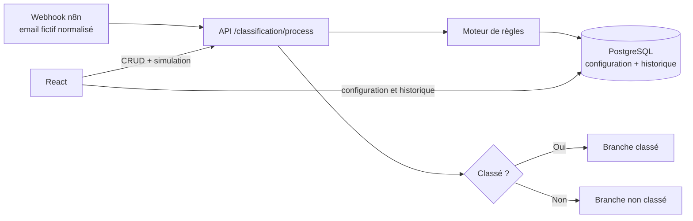

# Architecture du POC

## Fournisseurs de messagerie

Le domaine (`ClassificationRule`, `LabelDefinition`, `ProcessingLog`) reste indépendant des fournisseurs. Chaque agrégat est rattaché à un `MailboxConnectionId`. Le champ `Provider` est un type fermé (`Gmail` ou `Outlook`) et un résolveur sélectionne un adaptateur implémentant `IMailboxProviderAdapter`.

- `GmailMailboxService` normalise Gmail et applique des labels Gmail.
- `OutlookMailboxService` normalise Microsoft Graph et applique des catégories Outlook.
- `EmailProcessingService` et `ClassificationEngine` ne connaissent aucun fournisseur.
- n8n récupère toutes les boîtes actives et connectées, puis appelle `/api/mailboxes/{id}/sync` pour chacune.

Cette architecture **ports et adaptateurs** évite de dupliquer la logique métier et permet d’ajouter un fournisseur sans modifier le moteur de classement.

## Principes

La frontière principale sépare l'orchestration de la décision métier. n8n déplace les données et appelle les systèmes ; l'API décide et garantit les invariants. Le fournisseur de messagerie ne traverse jamais directement cette frontière : ses données devront d'abord être converties en email normalisé.

React n'accède pas réellement à PostgreSQL : les flèches représentent les responsabilités fonctionnelles, tous les accès passent par l'API.

Keycloak précède ces échanges : React utilise Authorization Code + PKCE, l’API valide les JWT, et n8n utilise un client confidentiel avec le rôle de service `automation`.

## Responsabilités

### React

- afficher la boîte, les labels, les règles et l'historique ;
- créer et modifier les règles, les activer ou les désactiver ;
- démarrer la connexion OAuth Gmail et afficher son état ;
- afficher l’état de la surveillance automatique et permettre une vérification immédiate de diagnostic ;
- envoyer un `NormalizedEmailRequest` au simulateur ;
- présenter la règle gagnante et ses critères.

React ne contient aucune logique de classement et aucune donnée fournisseur.

### API ASP.NET Core

- valider la cohérence boîte/label/règle ;
- normaliser les valeurs de configuration ;
- évaluer les règles actives par priorité croissante ;
- expliquer la décision ;
- garantir l'idempotence du traitement ;
- écrire un historique minimisé ;
- échanger et protéger le refresh token OAuth Gmail ;
- récupérer temporairement un message Gmail et appliquer le label externe.

Lorsqu’une règle choisit un label sans `ExternalLabelId`, l’API résout le nom auprès de Gmail ou crée le label utilisateur, conserve l’identifiant retourné puis vérifie la présence de cet identifiant dans la réponse de modification du message. Un identifiant devenu obsolète après une suppression ou un renommage direct dans Gmail est automatiquement résolu de nouveau.

Le `ClassificationEngine` ne dépend ni d'EF Core ni de n8n. Il reçoit un email et une collection de règles, ce qui le rend testable en mémoire. `EmailProcessingService` porte la lecture EF Core et la persistance idempotente.

### PostgreSQL

PostgreSQL stocke :

- `MailboxConnections` : racine fonctionnelle d'une boîte ;
- `LabelDefinitions` : labels internes et futur identifiant fournisseur ;
- `ClassificationRules` : destination, priorité, état et critères ;
- `ProcessingLogs` : identifiant externe, décision et explication.

L'index unique `(MailboxConnectionId, ExternalMessageId)` constitue la barrière d'idempotence. Le sujet, l'expéditeur et le corps ne sont pas stockés dans l'historique. Les tableaux de critères sont des colonnes PostgreSQL `text[]`.

`MailboxConnection.OwnerSubject` contient le claim `sub` émis par Keycloak. Toutes les lectures et mutations utilisateur vérifient cette propriété avant d’accéder aux entités enfants. Le compte de service n8n est le seul rôle autorisé à traverser les propriétaires pour découvrir les boîtes à automatiser.

Le Client ID et le secret OAuth sont administrés dans l’environnement du serveur et ne sont jamais saisis ou renvoyés par React. Le refresh token Gmail est stocké chiffré sur `MailboxConnection`. Les clés ASP.NET Core Data Protection vivent dans un volume Docker distinct afin qu’un rebuild de l’API ne rende pas ce jeton illisible. Le corps et le sujet complet des emails Gmail ne sont jamais persistés.

### n8n

- déclenche automatiquement une vérification chaque minute et conserve un webhook de diagnostic ;
- produit le contrat normalisé ;
- appelle `/api/classification/process` ;
- choisit la branche selon `isClassified` ;
- déclenche le traitement réel Gmail sans transporter le contenu complet des messages.

Le workflow exporté transporte explicitement `mailboxConnectionId`. Il n'implémente aucune règle complexe.

Le workflow Gmail réel récupère l’unique boîte active, transporte son `mailboxConnectionId`, puis déclenche l’opération côté API sans contenu d’email. L’API recherche les messages arrivés après la connexion OAuth, filtre ceux déjà journalisés, normalise temporairement chaque nouveau message, appelle le même moteur métier testable et applique le label externe. Cette frontière empêche le corps complet de se retrouver dans les données d’exécution n8n.

L'image n8n contient un bootstrap idempotent. Elle compare l’empreinte du workflow versionné à celle importée dans le volume `n8n-data` : un JSON modifié est automatiquement réimporté et publié, tandis qu’un rebuild sans modification ne crée aucun doublon. L’option `N8N_BOOTSTRAP_FORCE_IMPORT=true` permet toujours un remplacement explicite.

## Modèle de correspondance

Une règle possède jusqu'à quatre groupes : adresses d'expéditeur, domaines, mots-clés du sujet et mots-clés du corps. Une correspondance dans une liste suffit pour que son groupe corresponde. Le mode `Any` accepte un groupe correspondant ; le mode `All` exige tous les groupes non vides. La première règle correspondante gagne après tri par `Priority` croissante, puis par date et identifiant pour un résultat déterministe.

## Authentification et plusieurs utilisateurs

Keycloak porte désormais l’inscription, la connexion et les sessions. L’API ne crée pas d’entité utilisateur locale : elle conserve uniquement l’identifiant externe stable `sub` sur `MailboxConnection`. Cette frontière évite de dupliquer les mots de passe ou les profils et permet plusieurs boîtes par identité.

Le rôle `demo` ne peut exécuter que des lectures sur son jeu de données factice et des simulations non persistées. Le rôle `automation` est réservé au client confidentiel n8n. Les callbacks OAuth fournisseur restent anonymes par nécessité protocolaire, mais leur `state` signé ne peut être créé qu’après authentification et contrôle du propriétaire.

Les étapes futures envisagées sont :

1. vérifier les adresses email et activer la récupération de mot de passe avec un SMTP ;
2. ajouter `SummaryRequest` et `SummaryResult`, toujours rattachés à une boîte ;
3. déplacer les clés et jetons fournisseur vers un coffre de secrets en environnement partagé ;
4. ajouter des tests d’intégration HTTP avec un véritable émetteur OIDC de test ;
5. préparer le déploiement Keycloak en mode production derrière le reverse proxy du VPS.
